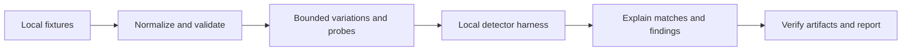

# DVI Sentinel

[](https://github.com/AegisTrace/dvi-sentinel/actions/workflows/ci.yml)

DVI Sentinel tests whether a declared detection survives safe changes to local
telemetry, then preserves an explained finding and a bounded counterexample.
It uses only synthetic/documentation fixtures: no live targets, attack traffic,
scenario commands or external detector integrations.

**Version:** `1.0.0`, the first public release of the local fixture workflow.
See the [release verification](docs/release_v1.md),
[safety audit](RELEASE_SAFETY_REVIEW.md) and [changelog](CHANGELOG.md) for evidence
and limits.

**V2 is in development.** The released commands and behavior described below are
V1. The [V2 scope](docs/v2_architecture.md) defines the next implementation sequence;
planned V2 capabilities are not release features.

## Run a finding

With Git and Python 3.12 or 3.13 installed, from an unused directory (PowerShell):

```powershell
git clone https://github.com/AegisTrace/dvi-sentinel.git
cd dvi-sentinel
python -m venv .venv
.venv\Scripts\python.exe -m pip install -e .
.venv\Scripts\dvi.exe doctor --json
.venv\Scripts\dvi.exe run examples/artifact_scenario.yaml --out runs/fragile --seed 42 --event-budget 256 --json
.venv\Scripts\dvi.exe ci-check runs/fragile --threshold 1 --json
```

The last command intentionally exits **1**: this fixture's local rule detects
2/11 variants and misses nine after its count limit is exceeded. The run itself
exits **0**, saves ten findings across variation/probe evidence, and retains a
minimal counterexample. Read `runs/fragile/report.md`, inspect the typed
`report.json`, or open the self-contained `report.html` locally.

On macOS/Linux, use your Python 3.12/3.13 executable and the corresponding
`.venv/bin/python` and `.venv/bin/dvi` paths. The package uses standard pip;
`uv sync --locked --extra dev` is also supported. The [reproduction record](docs/reproduction.md)
contains executed commands, artifact hashes and platform details.



## What the experiment measures

A detector can depend on incidental telemetry details: a source-field spelling,
timestamp format, optional sensor field, arrival order or exact event count.
DVI compares a detected baseline with changed inputs whose declared meaning is
independently checked. A failure is evidence about that local detector model and
fixture relation; it is not a claim about a production security product.

- **Inputs:** canonical/flat JSONL, strict CSV and a synthetic Suricata EVE subset
  for flow, alert, DNS and light HTTP metadata. Original source bytes and raw
  event digests remain available. See [event model](docs/event_model.md) and
  [adapter limits](docs/adapters.md).
- **Scenario and harness:** strict YAML declares fixture paths, expected
  detection, bounded variation permissions and explicit safety attestations.
  The harness reads local detector results or evaluates small declarative rules.
  See [scenario DSL](docs/scenario_dsl.md), [harness](docs/detector_harness.md) and
  [safety policy](docs/safety_model.md).
- **Experiments:** deterministic timing, ordering, metadata, harmless noise,
  duplicate-volume and optional-dropout cases retain lineage and independent
  invariants. Fixed [assumption probes](docs/assumption_probes.md) examine known
  dependencies. [Differential tests](docs/differential_testing.md) re-parse
  supported representations and distinguish mapping loss from detection changes.
- **Analysis:** [matching](docs/matching.md) reports detected, missed or unknown
  with reason codes and evidence. The [frontier](docs/resilience_frontier.md)
  reports explicit numerators/denominators and observed boundaries per family.
  [Shrinking](docs/failure_shrinking.md) preserves the original intent while
  reducing one eligible failure under a fixed budget.
- **Evidence:** [run bundles](docs/run_artifacts.md) capture configuration,
  source fixtures, observations, matches, scores and SHA-256 manifests.
  [Reports/provenance](docs/reports.md) trace findings to file, record and field
  references. [Comparison](docs/regression_comparison.md) checks compatibility
  before classifying detector regressions.

## Verify a robust control

From the installed checkout:

```powershell
.venv\Scripts\dvi.exe run benchmarks/benign_noise-control.yaml --out runs/robust --seed 42 --event-budget 256 --json
.venv\Scripts\dvi.exe ci-check runs/robust --threshold 1 --json
.venv\Scripts\dvi.exe report runs/fragile --overwrite --json
.venv\Scripts\python.exe examples/run_benchmarks.py --out runs/benchmarks/benchmark_report.json
```

These commands exit **0**. The robust control has no findings; the benchmark suite
passes 20 cases and 275 checks across ten fragility families and ten controls.
Oracles assert finding classes, reason codes, metric ranges and minimum
characteristics after real execution. See [benchmarks](docs/benchmarks.md) and
the [compatible regression example](docs/reproduction.md#verify-an-actual-regression).

Use a new output directory for each run. `--overwrite` only replaces a verified
previous DVI bundle. Exit **2** means invalid, incompatible or unavailable evidence;
the [CLI reference](docs/cli.md) explains each command's scope. A passing variant
gate does not silently certify separate probe or schema results.

## Develop and reproduce

```powershell
.venv\Scripts\python.exe -m pip install -e '.[dev]'
.venv\Scripts\ruff.exe check .
.venv\Scripts\ruff.exe format --check .
.venv\Scripts\mypy.exe src/dvi_sentinel
.venv\Scripts\python.exe -m pytest
.venv\Scripts\python.exe -m build
```

[CI](docs/ci.md) runs Python 3.12/3.13 with a 90% coverage floor, builds and installs
the wheel, and retains fixture/benchmark evidence. The recorded clean Windows
checkout passed 418 tests with one symlink-permission skip and 95% coverage;
Linux CI exercises the real symlink case. See [testing](docs/testing.md).

[Docker reproduction](docs/docker.md) uses a non-root image, disabled runtime
network, a read-only root and a runs mount. Native/Docker analysis bytes and the
benchmark report were compared in the [fresh-checkout proof](docs/reproduction.md).

## Limits and project records

V1 has finite search budgets, a fixed probe catalog and declared semantic
relations. Unknown results are not passes. Minima are local to supported
reductions; family-associated findings do not establish universal causality.
Hashes support integrity against an external trust anchor, not authorship.
The filesystem must be trusted and local. These are synthetic observations,
not live validation, ATT&CK coverage, Sigma execution or full schema compliance.

Read the [architecture](docs/architecture.md), [engineering notes](docs/engineering_notes.md),
[research sources](docs/research_sources.md) and [decision records](docs/adr/README.md)
for the implementation choices. The [roadmap](docs/roadmap.md) separates the V2
development plan from further research. The [changelog](CHANGELOG.md) records
delivered behavior and release status.

## V2 development roadmap

The V2 target is to analyze local defensive telemetry fixtures for brittle schema,
timing, correlation and evidence assumptions. Work starts with explicit semantic
signals and evidence bindings, then adds executable relations, loss-aware profile
projections, bounded temporal reasoning and independent oracle decisions. Search,
counterfactuals, uncertainty, graphs and reports follow only after those foundations
have executable proof.

The development package (`2.0.0.dev0`) includes the [semantic ontology library](docs/semantic_ontology.md):
signals, explicit evidence bindings, unknown/loss classification and deterministic
exports, exercised by [tests](tests/test_v2_ontology.py) and a
[runnable example](examples/semantic_ontology.py). The [semantic algebra](docs/semantic_algebra.md)
adds seven evidence-bound relations with explicit unknowns, contradiction suppression
and measured support fractions, exercised by [tests](tests/test_v2_semantic_algebra.py)
and a [runnable proof](examples/semantic_algebra.py). The [schema profiles](docs/schema_profiles.md)
add seven explicit local subsets, field/loss reports and measured roundtrips, exercised
by [mapping tests](tests/test_v2_mapping.py) and an [example](examples/schema_profiles.py).
The remaining capabilities above
are planned. V1 remains available at the `v1.0.0` tag. See the ordered
[V2 architecture contract](docs/v2_architecture.md),
[development standard](docs/development_standard.md) and
[card evidence record](docs/v2_build_log.md). Each card must pass tests, packaging
and CI before the next starts. V2 keeps the same local synthetic/fixture boundary.

Contributions follow [CONTRIBUTING.md](CONTRIBUTING.md) and the
[code of conduct](CODE_OF_CONDUCT.md). Report vulnerabilities privately through
the [security policy](SECURITY.md). MIT licensed; copyright AegisTrace.
