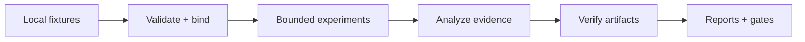

# DVI Sentinel

[](https://github.com/AegisTrace/dvi-sentinel/actions/workflows/ci.yml)

DVI Sentinel tests whether local detection logic survives changes to telemetry,
then explains the failures with reproducible evidence.

**Local synthetic fixtures only.** No live targets, attack traffic, executable
scenario hooks or external detector integrations.

**Released:** [V1 `1.0.0`](docs/release_v1.md). **On `main`:** implemented V2 development
(`2.0.0.dev0`), still unreleased. [Implemented vs planned](#v1-vs-v2).

**A concrete finding:** removing one optional correlation key can stop a local rule
from detecting the same two events. The tested control still detects them.
[Reproduce it](#example-brittle-correlation-key).

**Evidence:** 32 expert cases across 16 categories; 224 acceptance checks.
[Read the report preview](docs/example_report.md) · [Benchmark results](#benchmark-suite) ·
[Development proof](#development-proof) · [Architecture](#architecture)

## Quickstart

With Git and Python 3.12 or 3.13, from an unused directory (PowerShell):

```powershell
git clone https://github.com/AegisTrace/dvi-sentinel.git
cd dvi-sentinel
python -m venv .venv
.venv\Scripts\python.exe -m pip install -e .
.venv\Scripts\dvi.exe doctor --json
.venv\Scripts\dvi.exe run examples/v2/ci/scenario.yaml --out runs/quickstart --seed 42 --event-budget 256 --json
.venv\Scripts\dvi.exe ci-check runs/quickstart --threshold 1 --max-unknown 0 --json
```

All commands should exit **0**. The control detects all **7 planned variants**, with
no misses or unknowns. Open `runs/quickstart/report.html` locally; keep its neighboring
files. JSON, Markdown, captured evidence and a SHA-256 manifest are in the same bundle.

On macOS/Linux, use `.venv/bin/python` and `.venv/bin/dvi` in place of the Windows
executable paths. Use a fresh output directory on repetition. See the
[CLI contract](docs/cli.md) for verified overwrite and exit-code behavior.
This checkout runs V2 development; the published V1 remains at the `v1.0.0` tag.

## Architecture


```mermaid
flowchart LR
  F[Local fixtures] --> V[Validate + bind]
  V --> E[Bounded experiments]
  E --> A[Analyze evidence]
  A --> P[Verify artifacts]
  P --> R[Reports + gates]
```

The [V1 workflow](docs/architecture.md) remains the foundation. V2 adds explicit
[analysis commands](docs/cli.md#v2-analysis-commands) and native artifacts; `dvi run`
does not automatically execute every V2 stage. The [ten-command example](examples/v2_cli.py)
shows the data flow, including explanation evidence passed into the knowledge graph.

## What DVI Sentinel Does

Start with a detected baseline, declare which changes preserve its intended meaning,
and test bounded variations with the local harness. DVI records what changed, what
was preserved, whether the detection matched, and where evidence is missing.

Supported inputs are documented JSONL, CSV and EVE fixture subsets. Detection uses
captured local results or small declarative rules. Findings can retain a reduced
counterexample, source references and a verified report. See the
[scenario format](docs/scenario_dsl.md), [harness](docs/detector_harness.md) and
[artifact contract](docs/run_artifacts.md).

## Why Detection Resilience Matters

A rule can match a clean example yet depend on a field alias, optional sensor value,
arrival order or exact count. Making those dependencies visible gives maintainers
small regression cases to review and retest when a rule or schema changes.
These measurements describe the declared local model, not a production detector.

## V1 vs V2

| State | Delivered behavior | Evidence |
| --- | --- | --- |
| Released V1 | Fixture parsing, safe variations/probes, local rules, matching, shrinking, reports and regression gates | [Release proof](docs/release_v1.md), [V1 benchmarks](docs/benchmarks.md) |
| Implemented V2, unreleased | Ontology, seven semantic relations, seven schema subsets and bounded intent parsing | [Ontology](docs/semantic_ontology.md), [algebra](docs/semantic_algebra.md), [profiles](docs/schema_profiles.md), [intent](docs/detection_intent.md) |
| Implemented V2, unreleased | Ten temporal predicates and nine evidence oracles with explicit disagreement/unknowns | [Temporal engine](docs/temporal_correlation.md), [oracle consensus](docs/oracle_consensus.md) |
| Implemented V2, unreleased | Bounded exploration, semantic coverage, representation comparison, counterfactuals and oracle-aware shrinking | [Exploration](docs/constraint_exploration.md), [coverage](docs/semantic_coverage.md), [comparison](docs/cross_representation_testing.md), [counterfactuals](docs/counterfactual_causality.md), [shrinking](docs/failure_shrinking.md) |
| Implemented V2, unreleased | Conditional confidence, compatible regression history and evidence-linked knowledge graphs | [Statistics](docs/statistical_confidence.md), [history](docs/regression_comparison.md), [graph](docs/knowledge_graph.md) |
| Implemented V2, unreleased | Provenance DAGs, eighteen-section reports, ten analysis commands and installed-package/container CI | [Artifacts](docs/run_artifacts.md#v2-artifact-lineage-opt-in), [reports](docs/report_v2.md), [CLI](docs/cli.md#v2-analysis-commands), [CI](docs/ci.md) |
| Planned | Final V2 release gate and publication | [Ordered release criteria](docs/v2_architecture.md#artifacts-presentation-and-release) |

The [claim-to-evidence index](docs/readme_claims.md) links these groups to executable
examples and tests. Research candidates are kept in the [roadmap](docs/roadmap.md).

## Example: Brittle Correlation Key

The [fragile rule](benchmarks/correlation_key-fragile.yaml) requires two events with
`correlation_id: '123'`. Its baseline detects. The declared dropout experiment
removes optional correlation metadata while retaining protected event meaning.

| Measurement | Fragile rule | [Control rule](benchmarks/correlation_key-control.yaml) |
| --- | --- | --- |
| Baseline | Detected | Detected |
| Detected planned variants, baseline excluded | 0/1 | 1/1 |
| Findings | Correlation-key and optional-field dependency | None |
| Strict gate | Exit 1 | Exit 0 |

The reduced failure keeps **two events**, removes the key from **one** original event,
and adds no events, time shift or reordering. This is a local minimum under tested
reductions. It suggests reviewing the rule's dependency; it does not prove a
universal cause or a production fix.

```powershell
.venv\Scripts\dvi.exe run benchmarks/correlation_key-fragile.yaml --out runs/correlation --seed 42 --event-budget 256 --json
.venv\Scripts\dvi.exe ci-check runs/correlation --threshold 1 --max-unknown 0 --json
.venv\Scripts\dvi.exe run benchmarks/correlation_key-control.yaml --out runs/correlation-control --seed 42 --event-budget 256 --json
.venv\Scripts\dvi.exe ci-check runs/correlation-control --threshold 1 --max-unknown 0 --json
```

The second command intentionally exits **1**. Each `run` exits **0** after recording
its measurements; completing a run does not mean its detection gate passed.
The report and `minimal_case.json` retain the finding and reduction trace.

## Example Report

[](docs/example_report.md)

This is the separate synthetic volume example, captured from a verified report.
It preserves **not enough evidence** for oracle consensus and **insufficient sample**
for confidence. A measured miss does not turn missing evidence into a confirmed cause.

```powershell
.venv\Scripts\python.exe examples/advanced_report.py --out runs/example-report
```

Open `runs/example-report/report.html`. The bundle includes JSON/Markdown, a local
stylesheet and a portable ZIP. [Preview provenance and reproduction](docs/example_report.md)
record the source hashes; the [report contract](docs/report_v2.md) explains all sections.

## Benchmark Suite

```powershell
.venv\Scripts\dvi.exe benchmark benchmarks --out runs/benchmarks/v2 --json
```

The V2 suite accepts **32/32 diagnostic/control cases** across **16 categories**,
with **224 declared checks**. Categories cover schema/time/correlation dependencies,
optional fields and noise, representation/intent loss, oracle disagreement,
small-sample warnings and provenance tampering. The [full matrix](docs/benchmarks.md#v2-expert-suite)
describes each measurement and control.

Exit **0** means the observed outcomes match the declared expectations. A diagnostic
can intentionally be fragile, unknown or invalid; accepting that expected result
is not a deployment approval. Changed expectations or measurements fail with exit
**1**, retaining evidence. Invalid inputs fail with exit **2**. The earlier V1 suite
remains a separate regression constraint.

## Safety Model

All runtime work is bounded local fixture reading, inert transformations, declared
local rules and artifact analysis. No scanners, payloads, credentials, live target
calls or scenario-supplied shell commands are supported. Network access is needed
for dependency installation/build and repository CI transport, not fixture analysis.

Read the [safety model](docs/safety_model.md), [security policy](SECURITY.md) and
[restricted Docker reproduction](docs/docker.md). Synthetic declarations are not a
content classifier, and application policy is not an operating-system sandbox.

## Development Proof

From the same environment:

```powershell
.venv\Scripts\python.exe -m pip install -e '.[dev]'
.venv\Scripts\ruff.exe check .
.venv\Scripts\ruff.exe format --check .
.venv\Scripts\mypy.exe src/dvi_sentinel
.venv\Scripts\python.exe -m coverage run -m pytest
.venv\Scripts\python.exe -m coverage report --fail-under=90
.venv\Scripts\python.exe -m build
.venv\Scripts\python.exe examples/v2_cli.py --out runs/cli-example
```

The [V2-19 verification record](docs/v2_build_log.md#v2-19---cicd-and-release-hardening)
records **1,248 tests passed on each of Python 3.12/3.13** and **94.90% combined
statement/branch coverage**. These are recorded results, not a promise about later commits.
[CI](docs/ci.md) also builds/installs the wheel, checks packaged assets, verifies actual
benchmark/report evidence and expected failures, and runs a network-disabled container.

## Limitations

- Search and shrinking have finite budgets. Local minima and counterfactual effects
  apply to tested fixtures; they are not exhaustive or universal causal proofs.
- Missing evidence stays unknown. Statistical confidence is conditional on the
  declared cohort and assumptions; it does not establish real-world effectiveness.
- Schema profiles are documented subsets. There is no full ECS/OCSF compliance,
  complete Sigma compiler, live collection or external SIEM/EDR integration.
- Hashes and provenance DAGs establish recorded consistency, not authenticated
  authorship. Use a trusted local filesystem and retain external manifest pins.

## Roadmap

V2's implemented engines remain unreleased until the final package, Docker, artifact,
claim, safety and rendered-report release checks pass. See the
[release criteria](docs/v2_architecture.md#artifacts-presentation-and-release) and
[card records](docs/v2_build_log.md). Broader schema compliance, solver dependencies,
signed attestations and an SBOM remain [research candidates](docs/roadmap.md), not
current features.

Updates are made directly on `main`. Follow [CONTRIBUTING.md](CONTRIBUTING.md) and the
[code of conduct](CODE_OF_CONDUCT.md); report vulnerabilities through
[SECURITY.md](SECURITY.md). MIT licensed; copyright AegisTrace.
