# Architecture

V1 is a local Python library and CLI. It has no daemon, listener, remote detector
client, database or plugin loader. The `src/dvi_sentinel/` package separates
validated values, pure analysis and explicit local I/O.

```mermaid
flowchart TD
  CLI[CLI presentation] --> W[Workflow orchestration]
  W --> I[Scenario and fixture boundaries]
  I --> N[Adapters and canonical events]
  W --> P[Variations and fixed probes]
  N --> P
  P --> C[Independent invariants and policy]
  P --> H[Fixture or local-rule harness]
  H --> M[Matching and scoring]
  C --> M
  W --> D[Differential representations]
  D --> H
  W --> S[Bounded failure shrinking]
  S --> C
  S --> H
  M --> A[Artifact construction and verification]
  A --> R[Reports and provenance]
  A --> B[Compatible snapshot comparison]
```

Arrows show coordination/data dependencies, not every import. Typed value modules
are shared; engines never call the CLI. The orchestration layer owns filesystem
reads/writes and passes explicit values to the analysis functions.

| Boundary | Modules and responsibility |
| --- | --- |
| Inputs | `scenario.py`, `scenario_io.py`, `local_fixtures.py`, `policy.py`: strict scenario values, bounded safe YAML/local reads, declarations and content rejection. |
| Events and adapters | `models.py`, `serialization.py`, `adapters.py`, `adapter_mapping.py`: DVI-native normalized events, raw snapshots, deterministic JSON/digests, explicit mappings and parse errors. |
| Experiments | `variations.py`, `invariants.py`, `probes.py`, `probe_sources.py`, `probe_transforms.py`: seeded bounded cases and fixed relations, with independent preservation and lineage evidence. |
| Observations | `harness.py`, `harness_models.py`: a small `DetectorHarness` protocol with two concrete local implementations. No external process or query conversion. |
| Analysis | `matching.py`, `scoring.py`, `taxonomy.py`, `comparison.py`: explained outcomes, honest denominators, evidence-linked classes and compatibility-aware regression. |
| Schema/minimum evidence | `differential.py`, `fixture_encoding.py`, `shrinking.py`, `reductions.py`: re-parse representations, measure loss, reduce one safe failure and record bounded ablations. |
| Bundles and rendering | `run_artifacts.py`, `artifact_store.py`, `artifact_contract.py`, `reports.py`, `provenance.py`, `report_rendering.py`: construct and verify evidence, then render JSON/Markdown/static HTML. |
| Integration | `workflow.py`, `cli/`: prepare local inputs, execute the bounded experiment, publish a complete bundle and present stable exit codes. `benchmarks.py` executes declared local cases and checks separate oracles. |

Companion `*_models.py` modules define each engine's typed boundary. The event
model retains frozen values and immutable raw snapshots; frozen models are not a
promise that every nested mapping in every contract is deeply immutable. Public
inputs must use validation, not unchecked Pydantic construction.

## Failure handling

Invalid scenario/input data is rejected before publishing a run. Harness absence,
unsupported representations and incomplete detection evidence remain unknown.
Preservation failures remain visible and cannot establish safe fragility.
The CLI distinguishes completed experiments (0), measured gate/regression failures
(1), and invalid/incompatible/unavailable evidence (2).

The writer verifies a staged complete bundle before publication. Reports consume
verified artifacts; comparing bundles verifies both before reading snapshots.
The benchmark JSON is a separate deterministic evidence format, not a manifest
bundle. See [artifact contracts](run_artifacts.md) for trust and crash limits.

## Concrete trace

`examples/artifact_scenario.yaml` loads two synthetic observations and a local
count-limited rule. The baseline detects. Safe duplicates can exceed the rule's
count limit without deleting either original event. Matching records a miss,
the frontier links it to volume sensitivity, and shrinking keeps the smallest
accepted reproducer found under its reductions. The report links that finding
to captured inputs, variation lineage, observation, match and score evidence.
The [fresh-checkout proof](reproduction.md) records the measured results.

For the tradeoffs behind these boundaries, see [engineering notes](engineering_notes.md)
and the [four decision records](adr/README.md).
