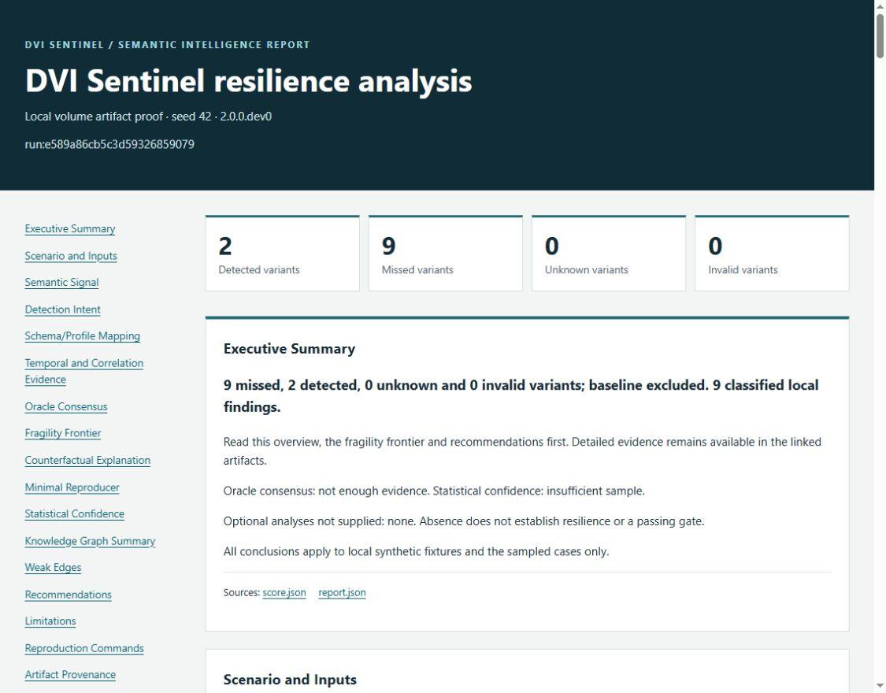

# Example report: measured misses and unresolved evidence

This is an unmodified browser capture of the advanced report generated by
[examples/advanced_report.py](../examples/advanced_report.py). It uses the synthetic
volume fixture, which is separate from the README's correlation-key example.



## What the preview means

The local count-based rule detects the baseline. Across eleven planned volume
variants, it detects two and misses nine, producing nine classified findings.
Those counts exclude the baseline and do not include a separate assumption-probe run.

The advanced analyses preserve narrower conclusions: oracle consensus is
`not_enough_evidence`, oracle-aware shrinking stops as `unknown`, and confidence is
`insufficient_sample`. The counterfactual study records one local volume finding;
its graph contains 354 nodes, 748 edges and 174 weak edges. These are different
analysis scopes, not interchangeable finding counts. Recommendations are review
and retest proposals, not verified remedies.

## Reproduce the complete bundle

After the [quickstart installation](../README.md#quickstart):

```powershell
.venv\Scripts\python.exe examples/advanced_report.py --out runs/example-report
.venv\Scripts\dvi.exe report runs/example-report --advanced --overwrite --json
```

On macOS/Linux, use `.venv/bin/python` and `.venv/bin/dvi`. The example requires a
fresh directory; regeneration requires the intact verified bundle. Both commands
exit 0. Open `runs/example-report/report.html` locally with neighboring evidence
and `report_assets/report.css`. The ZIP contains a portable bundle with its own
manifest and DAG. The example verifies its final manifest before reporting success.

The [report contract](report_v2.md) explains all eighteen sections, scope checks,
escaping and archive verification. The [CI contract](ci.md) retains this executable
example's complete bundle for seven days; repository documentation keeps only this
reviewed preview and its reproduction record.

## Capture and provenance

Captured on 2026-10-10 from `2.0.0.dev0`, using the unchanged report engine at
commit `f2dedacbe5c5669dfc297665e51937c976837d8c`. The generated bundle was verified
before inspection. Its HTML and stylesheet were served only on loopback, and the
browser viewport was captured without altering the page or image. The preview is
1125 by 880 pixels; the overview, counts, navigation and uncertainty labels were
visually inspected. No mobile or print rendering claim is made.

The example uses a fixed 2026-09-27 fixture timestamp and records no Git commit in
the run itself. That timestamp is test data, not the capture date. The source commit
above identifies the implementation used for this documentation capture.

| File | Bytes | SHA-256 |
| --- | ---: | --- |
| `report.html` | 35,140 | `c1c63e9e801213525ffe63c522ee75524337526e6dff24efd6ccbdd5f29e10ed` |
| `report.json` | 1,146,529 | `9567fe4cd389748b099dcbf55f7a3b4808e904c873d7ab4124e5742c56623783` |
| `report_assets/report.css` | 3,156 | `436f74314a3c3f5be57148f0a069943b749b8158e43d6eb688bdecba3a88833d` |
| `manifest.json` | 6,566 | `c698d8750a0fb39dee58e098ac8907e5f43196c41dae0bb2ad99abe26bab3063` |
| `provenance_dag.json` | 51,598 | `66ae015ec836cd378c32747fb5a109d711b77e0756fb24685c3d7faad4b44006` |
| [Preview JPEG](assets/report-v2.jpg) | 87,711 | `cd1a6495398f48dfccc718c97969b0312ffc4b85cef9ce9184c73cc3400af512` |

The screenshot is a documentation artifact outside the run manifest. Rendering can
vary with browser and viewport; native artifact hashes are the reproducibility
anchors. Hashes demonstrate consistency, not authorship or real-world effectiveness.
