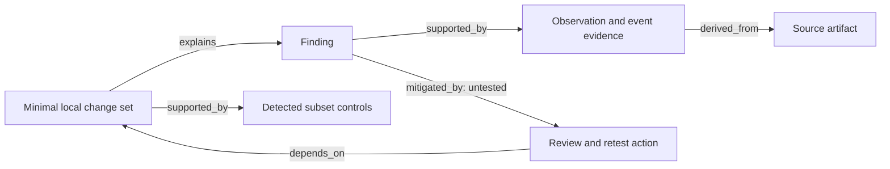

# Detection knowledge graph

V2-14 projects one pinned [counterfactual study](counterfactual_causality.md) into
a deterministic typed graph. It answers which observation supports a finding,
which tested changes and controls support its local cause, and which proposed
review action addresses that cause. Four JSON views retain the links and their
limitations. This is a library/example feature in V2 development.

## Input and integrity boundary

`build_detection_graph(source, expected_digest=producer_pin)` accepts a complete
`CounterfactualSummary`. The source is one measured local study containing its
input, cases, observations, matches, transformations, invariant checks, tested
failure sets and paired effects. It is not a file path or arbitrary edge list.

The external pin is the SHA-256 of DVI canonical summary JSON without a final
newline. Retain that digest independently when producing the study. A missing pin
produces `unknown`; a different pin or rejected safety/provenance/matching evidence
produces `unsafe_rejected`. Both omit source content and return an empty graph.
Upstream blocked studies remain blocked. Invalid typed records and exceeded bounds
raise an error rather than returning a truncated graph.

Before any matching, intent or ontology analysis, every original/candidate event,
observation and expectation passes the existing safety/provenance preflight. The
declared harness is also inspected as inert data. Recorded matches are recomputed
from the actual observations. The graph builder does not execute the detector,
replay transformations, read files, fetch profiles or access a graph service.

The full report retains the source. Validation rederives the graph, checks source
identity, and recomputes its summary. Changing graph content and updating its node
and edge hashes still fails if that content differs from the source projection.
A coherent rewrite of source and trusted pins is outside hash integrity: these
records do not authenticate authorship or prove a detector was actually executed.

## Evidence paths

Every node and edge carries source references with:

- `artifact`: the fixed `counterfactual_summary.json` name;
- `sha256`: the exact UTF-8 artifact hash, including its final newline;
- `pointer`: an exact JSON pointer into that source document;
- `value_digest`: the DVI canonical digest of the selected value.

An empty pointer selects the complete source document. Array indices are exact
nonnegative decimal indices; object keys use JSON pointer escaping. A field-binding
projection can cite the complete event containing its values and raw source
snapshot, rather than implying that a derived value appeared verbatim in the input.
Rule requirements cite their actual declaration. All derived facts remain
reproducible from those source slices and the implemented projection contract.

The example saves the exact source artifact beside its graph files. The builder
assembles references from source values; it does not trust caller-supplied links.
All IDs use full SHA-256 content digests prefixed with `node:` or `edge:`. Content,
references and weaknesses participate in identity. Nodes and edges are sorted by
ID, so iteration order never changes output. Repeated logical values at different
source locations have distinct identities: source provenance is not merged away.



Every finding has direct observation and event evidence, which in turn links to
the artifact. Each recommendation has a counterfactual cause, its finding and
the measured proper-subset controls. A recommendation is emitted only for a
verified local minimal failure set. Missing or unresolved controls cannot create
one. A robust study has no invented finding or recommendation.

## Types and relationships

The node vocabulary is `run`, `detector`, `semantic_signal`, `entity`, `observable`,
`evidence_field`, `schema_profile`, `adapter`, `detection_intent`, `data_source`,
`data_component`, `invariant`, `transform`, `variation_case`, `oracle_decision`,
`finding`, `counterfactual`, `recommendation` and `artifact`.

Signals and bindings reuse [canonical ontology extraction](semantic_ontology.md).
Explicit entities are preserved; absent entities are not inferred. `schema_profile`
records the exact canonical ontology projection definition, not a claim of full
vendor-schema conformance. Adapter, source and component nodes retain recorded
adapter/sensor/vendor/category metadata. They are not external catalog assertions.
Rule declarations reuse [intent parsing and binding analysis](detection_intent.md).
Field binding results do not replace whole-rule, count or sequence evaluation.

| Edge | Source-backed interpretation |
| --- | --- |
| `requires` | A rule intent requires a declared field; a planned transform requires its declared policy. |
| `preserves` | An executed step records a passing invariant check. |
| `violates` | A combined proposal records an invariant rejection before measurement. |
| `normalizes_to` | A field binding resolves to an observable, or a recorded adapter is associated with the canonical signal. |
| `maps_to` | A source/case maps to a canonical projection, explicit entity or observed rule-field binding. |
| `depends_on` | A run, case, source or recommendation links to its declared dependency or tested cause. |
| `explains` | A verified minimal change set explains a local finding under the tested controls. |
| `weakens`, `strengthens` | Actual paired losses or recoveries establish a conditional local direction. |
| `mitigated_by` | A proposed review/retest action addresses a finding; mitigation remains untested. |
| `derived_from` | A recorded or projected fact links to source evidence or a recorded transformation. |
| `supported_by` | An observation, check or control supplies evidence, with unresolved support marked weak. |
| `contradicted_by` | A diagnostic opposes a gap claim or records contradictory context; the original decision is retained. |

Only relationships supported by the current input are emitted. For example, a
study with no paired recoveries contains no `strengthens` edges. Planned dimensions
carry policy dependencies; executed transformations additionally carry their
actual recorded invariant checks. Rejected combined proposals are not attributed
individually to every active dimension.

Graph validation rejects duplicate identities/keys, unsorted collections, dangling
endpoints, incompatible relation types, self edges, isolated nodes, disconnected
components and missing required finding/cause/invariant/evidence links. The graph
has one source artifact. The recommendation view is the outgoing cause/evidence
closure, retaining links between selected nodes. It is empty when there are no
recommendations. Cycles such as recommendation/cause/finding are meaningful here;
this graph is separate from V2-15's planned artifact provenance DAG.

## Weak edges and unknowns

`weaknesses` is an explicit sorted list of reason codes, not a probability:

| Reason | Meaning |
| --- | --- |
| `missing_evidence` | An ontology binding has no supplied value, including explicit optional absence. |
| `unknown_evidence` | A binding/check is ambiguous, unresolved or warns about support. |
| `unavailable_check` | The evidence does not support an applicable diagnostic. |
| `conflicting_evidence` | Observed binding/check evidence opposes the proposed relation or claim. |
| `declared_source` | Source metadata, projection use or a dependency is a producer declaration. |
| `recorded_preservation` | The study records a check; the graph does not replay that transformation. |
| `local_association` | A cause or paired effect is conditional on tested local controls. |
| `untested_remedy` | A review/retest action has no measured mitigation proof. |
| `unresolved_case` | A case is invalid, unknown or unexecuted. |

Independent [oracle results](oracle_consensus.md) keep their own decisions, reason
codes and resolution confidence. A safety/semantic guard pass does not establish a
detection gap. A timely alert with the wrong signature can oppose the timing claim
while the matcher still records a miss. Missing alerts cannot establish alert
latency. These limitations remain visible rather than being converted into strong
support. `built` means graph construction succeeded; it is not a passing detection
or release gate. Known local fragility, unknowns and weak edges can coexist.

## Run the example

From an installed development checkout, use a new directory:

```sh
python examples/knowledge_graph.py --out runs/v2/knowledge-graph-proof
```

The example executes the existing fixed local rule harness first, then constructs
graphs from its retained results. Its combined-change fixture needs both sensor
and vendor dropout to lose the signal; all three proper-subset controls detect.
The robust fixture has no measured minimal failure. A one-evaluation budget records
unexecuted cases explicitly and produces no recommendation.

| File in each example subdirectory | Contents |
| --- | --- |
| `counterfactual_summary.json` | Exact source study used by all graph references. |
| `detection_graph.json` | Full source-linked, validated graph report. |
| `weak_edges.json` | Exact weak edges, linked to full report and graph digests. |
| `recommendation_graph.json` | Cause/evidence closure for recommendations, with shared anchors. |
| `graph_summary.json` | Type counts, findings, recommendations, weaknesses and state, with shared anchors. |

`graph_artifacts(source, expected_digest=producer_pin)` returns the four graph
files as bytes. The source file is retained separately by the producer/example.
When consuming exported slices, first validate the full `GraphReport`, compare
`report_digest` and `graph_digest`, and reproduce the corresponding slice. A slice
is not independent proof of its own completeness. No renderer or NetworkX is
required. GraphML, interactive HTML and integrated CLI output remain later work.

## Bounds and limits

The complete source is at most 4 MiB, with at most 64 cases, 128 retained candidate
events and 256 observed detections. Original input retains V2-10's eight-event,
eight-rule and six-dimension bounds. Graphs have at most 8192 nodes and 32768
edges; the four graph artifacts combined are at most 32 MiB. Existing nested
model/string/observation limits also apply. Any exceeded bound fails explicitly.

These files are deterministic local analysis artifacts, not a verified V1 run
bundle or a signed account of chronology. The input adapter supports the existing
counterfactual study contract; other run/bundle types require their own verified
integration. Future reports must consume this actual evidence rather than invent
missing lineage, mitigation, statistical certainty or production effectiveness.

The [graph tests](../tests/test_v2_graph.py) exercise source paths, real failure and
control cases, recommendation causes, weak/contradictory support, invariant links,
typed topology, tampering, deterministic exports, bounds and output protection.
