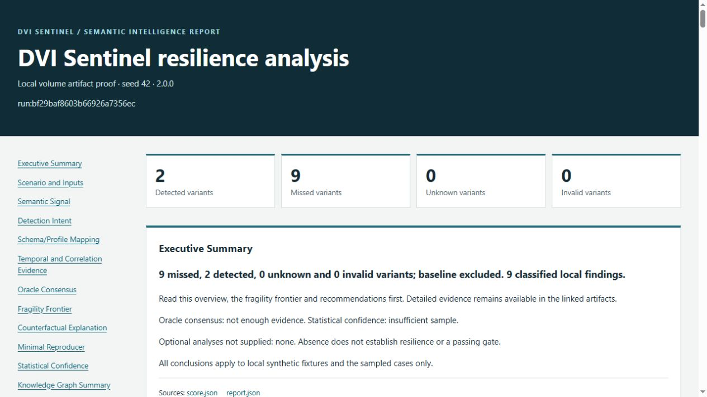

# V2 release verification

Version `2.0.0`, 2026-10-10. DVI Sentinel evaluates local synthetic/documentation
fixtures and declarative detector models. V2 adds bounded semantic analysis,
explicit uncertainty, expert benchmarks and verified advanced reports. The
[claim index](readme_claims.md) links capabilities to their contracts and tests.

## Release change

Package metadata, the version constant and lockfile move together from
`2.0.0.dev0` to `2.0.0`. Dependencies and detector behavior are unchanged.
The [release example](../examples/release_v2.py) combines the existing advanced
report with a fresh full expert benchmark. It captures every benchmark source,
checks its original size/digest and declares explicit provenance parents.
Two regression tests check source capture, transitive tampering and source changes
between execution and capture. All three CI jobs generate and verify this bundle.

## Full quality gate

Preparation commit `82f06708b61fd94bf4aaee749e2352de0140f801` passed
[all three CI jobs](https://github.com/AegisTrace/dvi-sentinel/actions/runs/38063554982).
Python 3.12 and 3.13 each passed 1,250 tests with no skips, failures or errors and
94.90% combined statement/branch coverage. Test durations were 344.929 and 251.124
seconds respectively. Local focused release-source/tampering tests passed both
cases; the existing four foundation/version tests also passed.

JUnit and coverage XML were downloaded and checked. Each CI job retained a
nonempty evidence artifact; all three release bundles matched the inspected local
97-file bundle byte for byte, including the same external manifest pin. The final
documentation commit and publication assets require their own exact-commit CI
verification; the release notes identify that final commit and run.

## Package and command proof

Local Ruff lint/format, strict mypy, actionlint, lock validation and installed
version equality passed. A wheel and source archive were built, and the wheel was
installed in a fresh Python 3.12.14 environment with seventeen compatible runtime
packages. Import inspection confirmed the installed package rather than `src/`.

All 25 earlier standalone examples ran successfully from a fresh copy of tracked
fixtures, with the CI verifier run separately. All copied inputs remained unchanged.
Doctor reports ready; the robust V2 scenario detects all seven planned variants
and passes threshold 1 with maximum unknown rate 0. The fragile control detects
two of eleven variants and correctly fails that gate with exit 1. Report replacement
without explicit overwrite correctly exits 2. The ten-command V2 example passed.

The V1 benchmark suite retains its twenty cases and 275 checks. The V2 expert suite
passes all 32 cases across sixteen categories and 224 declared checks. Expected
diagnostic unknowns or misses are not detection-gate passes or deployment approval.
Compatible regression examples retain measured regressions, unchanged fragility
and recovery rather than treating historical misses as new failures.

The complete release report is reproducible from the repository root using an
installed environment. The commands below use the verified wheel environment:

```powershell
.venv-release-v2\Scripts\python.exe -m examples.release_v2 --out runs/release-v2
.venv-release-v2\Scripts\dvi.exe report runs/release-v2 --advanced --overwrite --json
```

Use a new directory for the first command. The second consumes and verifies the
existing bundle; it does not rerun detection. The release example uses the fixed
2026-09-27 timestamp from the advanced fixture and retains that fixture's original
invocation in `run.json`; those fields are not the release date or the complete
release orchestration command. The commands above reproduce the combined bundle.

The report includes intentional volume misses and unresolved analysis evidence.
Its detection gate is expected to fail. The separate
[robust CI scenario](../examples/v2/ci/scenario.yaml) supplies the required passing
release control; [CI reproduction](ci.md#local-reproduction) gives its commands.

## Artifact and provenance verification

`runs/release-v2/` contains 97 files, including `report.html`, `report.md`,
`report.json`, `manifest.json`, `provenance_dag.json`, `benchmark_report.json`,
captured benchmark sources, a stylesheet and a portable report ZIP.
The manifest and DAG verify against independently captured digests; regeneration
preserves the complete bundle. The report's evidence DAG covers 87 artifacts and
110 parent links. The portable ZIP has its own manifest/DAG and no nested archive.

| Artifact | SHA-256 |
| --- | --- |
| Final manifest | `08056f72fca8300f31b4c444234e8eb0d52eb87959b73cb35712669bb7ee942f` |
| V2 benchmark report | `ed3ef1fa73d4148dd36e7ffd429b13348ca21cce2643a47e16282acec8358690` |

The benchmark hash differs from development records because the recorded tool
version changed. Hashes establish consistency with retained pins, not authorship.
Complete run bundles remain outside the repository; CI retains them for seven days.

## Docker reproduction

`docker build --tag dvi-sentinel:2.0.0 .` passed. Doctor, both run/gate controls,
report regeneration/refusal, full expert benchmark, ten-command CLI example,
advanced report and release bundle passed with networking disabled, non-root
UID/GID 10001, a read-only root, dropped capabilities, no-new-privileges and a
128-MiB temporary filesystem. The complete 97-file release bundle matched the
native wheel output byte for byte and verified against the same manifest pin.
All 107 packaged runtime files/assets matched their source. See the exact
restricted invocation in the [CI workflow](../.github/workflows/ci.yml).

## Visual inspection



The actual verified HTML was served on loopback and inspected in a browser on
2026-10-10. The overview, navigation, statistical-confidence table and provenance
section were readable. The capture is unmodified; it shows two detected and nine
missed variants, unresolved oracle consensus and insufficient statistical sample.
This is an engineering visual inspection, not a claim of owner approval or formal
accessibility certification. No mobile or print-layout claim is made.
The 1265-by-712 JPEG is 82,340 bytes; its SHA-256 is
`2fcc4b0a50165d130f2b7c866de02a2b1f93025e4344d26e5b4769c375eebe9d`.

## Safety and remaining limits

The [V2 safety review](../RELEASE_SAFETY_REVIEW.md#v2-release-review) covers all
103 runtime modules, local input/output boundaries, examples and release changes.
No live detector service, network client, subprocess execution, dynamic scenario
code or new runtime dependency was introduced. The report producer is an example
orchestrator over existing bounded readers, analyzers and writers.

All findings remain conditional on declared local fixtures and finite search.
Profiles are documented subsets, not full ECS/OCSF compliance or a Sigma compiler.
Statistical intervals do not establish production effectiveness. Trusted local
roots and a single writer are assumed. Signed attestations, an SBOM and native
analysis SARIF/JUnit exports remain future work; CI pytest JUnit is a test artifact.

## Publication boundary

Publication requires successful Python 3.12, Python 3.13 and container CI for the
exact release commit, plus the local package, artifact, claim, safety and visual
checks above. The annotated `v2.0.0` tag identifies that commit. GitHub release
notes carry its exact commit, CI links, wheel, source archive and SHA-256 inventory.
No PyPI publication, signed attestation or container-registry image is claimed.
